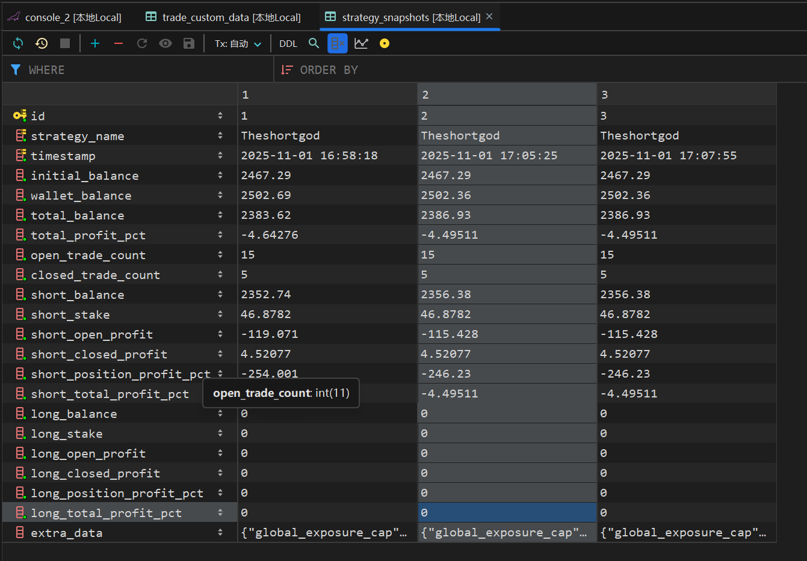

# BaseStrategyWithSnapshot - 策略资金快照和账户分离

## 概述

`BaseStrategyWithSnapshot` 是一个增强的策略基类，提供以下核心功能：

1. **资金快照记录**：自动将每个 bot loop 的资金状态保存到数据库
2. **Long/Short 账户分离**：独立管理做多和做空账户的资金
3. **详细统计日志**：输出格式化的资金统计信息
4. **严格资金限制**：可选的账户余额限制，防止过度开仓
5. **多场景兼容**：自动适配实盘、模拟盘、回测、超参数优化等不同运行模式

## 快速开始

### 1. 继承基类

```python
from freqtrade.strategy import BaseStrategyWithSnapshot

class MyStrategy(BaseStrategyWithSnapshot):
    # 你的策略代码
    pass
```

### 2. 配置文件

在 `config.json` 中添加配置：

```json
{
    "strategy_account": {
        "enabled": true,
        "long_initial_balance": 2000,
        "short_initial_balance": 2000
    },
    "strategy_snapshot": {
        "enabled": true,
        "enable_detailed_logs": true,
        "enable_strategy_logs": true,
        "snapshot_frequency": 1
    }
}
```

### 3. 运行

```bash
freqtrade trade --config config.json --strategy MyStrategy
```

## 核心功能

### 1. 资金快照 (Strategy Snapshot)

每个 bot loop 自动保存以下数据到 `strategy_snapshots` 表：

- 初始资金、钱包余额、总资产
- Long/Short 账户的详细资金情况
- 持仓盈亏、已平仓盈亏、收益率
- 持仓订单数、已平仓订单数
- 策略自定义数据（可选）

**查询示例**：

```sql
-- 查看最近10条快照
SELECT timestamp, strategy_name, wallet_balance, total_profit_pct
FROM strategy_snapshots
ORDER BY timestamp DESC
LIMIT 10;

-- 查看账户盈亏
SELECT timestamp,
       short_closed_profit, short_open_profit, short_total_profit_pct,
       long_closed_profit, long_open_profit, long_total_profit_pct
FROM strategy_snapshots
WHERE strategy_name = 'MyStrategy'
ORDER BY timestamp DESC;
```

### 2. Long/Short 账户分离

#### 启用模式

```json
{
    "strategy_account": {
        "enabled": true,          // 启用账户分离并严格限制
        "long_initial_balance": 2000,
        "short_initial_balance": 2000
    }
}
```

#### 禁用模式

```json
{
    "strategy_account": {
        "enabled": false         // 不分离账户，仅统计展示
    }
}
```

#### 使用比例分配

```json
{
    "strategy_account": {
        "enabled": true,
        "use_ratio": true,
        "long_ratio": 0.3,       // Long 账户占 30%
        "short_ratio": 0.7       // Short 账户占 70%
    }
}
```

### 3. 在策略中使用账户限制

```python
def custom_stake_amount(
    self,
    pair: str,
    current_time: datetime,
    current_rate: float,
    proposed_stake: float,
    max_stake: float,
    leverage: float,
    entry_tag: Optional[str],
    side: str,
    **kwargs,
) -> float:
    """控制开仓金额，应用账户余额限制"""

    # 你的开仓金额逻辑
    desired_stake = 100.0

    # 检查账户余额限制
    allowed, adjusted_stake = self.check_account_balance_limit(
        side=side,
        proposed_stake=desired_stake,
        pair=pair
    )

    if not allowed:
        # 账户余额不足，不允许开仓
        return 0.0

    # 返回调整后的金额
    return min(adjusted_stake, max_stake)
```

### 4. 自定义策略日志和数据

```python
class MyStrategy(BaseStrategyWithSnapshot):

    def log_strategy_specific_info(
        self, current_time: datetime, asset_data: dict, **kwargs
    ) -> None:
        """记录策略特定的信息"""
        import logging
        logger = logging.getLogger(__name__)

        logger.info("🎯 【我的策略信息】")
        logger.info(f"  自定义参数1: {self.my_param.value}")
        logger.info(f"  自定义参数2: {self.my_param2}")

        # 显示各账户可用余额
        if self.strict_account_mode:
            long_available = self.get_account_available_balance("long")
            short_available = self.get_account_available_balance("short")
            logger.info(f"  Long 账户可用: {long_available:.2f} USDT")
            logger.info(f"  Short 账户可用: {short_available:.2f} USDT")

    def get_extra_snapshot_data(self, asset_data: dict) -> Optional[dict]:
        """保存策略特定的参数到数据库"""
        return {
            'my_param': float(self.my_param.value),
            'my_param2': self.my_param2,
            'custom_indicator': self.custom_value,
        }
```

## 配置说明

### strategy_account 配置

| 参数 | 类型 | 默认值 | 说明 |
|-----|------|-------|------|
| `enabled` | bool | false | 是否启用账户分离（启用即严格限制） |
| `long_initial_balance` | float | 钱包余额 * 0.5 | Long账户初始资金 |
| `short_initial_balance` | float | 钱包余额 * 0.5 | Short账户初始资金 |
| `use_ratio` | bool | false | 是否使用比例分配 |
| `long_ratio` | float | 0.5 | Long账户资金比例 |
| `short_ratio` | float | 0.5 | Short账户资金比例 |

### strategy_snapshot 配置

| 参数 | 类型 | 默认值 | 说明 |
|-----|------|-------|------|
| `enabled` | bool | true | 是否保存快照到数据库 |
| `enable_detailed_logs` | bool | true | 是否输出详细的资金统计日志 |
| `enable_strategy_logs` | bool | true | 是否输出策略特定日志 |
| `snapshot_frequency` | int | 1 | 快照保存频率（每N个loop保存一次） |

## 运行模式兼容性

基类会自动检测运行模式并调整默认行为：

| 运行模式 | 快照默认值 | 日志默认值 | 快照频率 | 说明 |
|---------|----------|----------|---------|------|
| **实盘 (LIVE)** | 启用 | 启用 | 每次 loop | 完整功能 |
| **模拟盘 (DRY_RUN)** | 启用 | 启用 | 每次 loop | 与实盘相同 |
| **回测 (BACKTEST)** | 启用 | 启用 | 每10个 loop | 自动降低频率 |
| **超参数优化 (HYPEROPT)** | 禁用 | 禁用 | 每100个 loop | 优化性能 |

### 覆盖默认行为

```json
{
    "strategy_snapshot": {
        "enabled": true,              // 强制启用（即使在hyperopt中）
        "enable_detailed_logs": false, // 关闭详细日志
        "snapshot_frequency": 5        // 每5个loop保存一次
    }
}
```

## API 参考

### 可用方法

#### `get_account_available_balance(side: str) -> float`

获取指定账户的可用余额。

**参数**:
- `side`: `"long"` 或 `"short"`

**返回**: 可用余额（USDT）

**示例**:
```python
long_available = self.get_account_available_balance("long")
short_available = self.get_account_available_balance("short")
```

#### `check_account_balance_limit(side: str, proposed_stake: float, pair: str = "") -> Tuple[bool, float]`

检查提议的开仓金额是否超过账户限制。

**参数**:
- `side`: `"long"` 或 `"short"`
- `proposed_stake`: 提议的开仓金额
- `pair`: 交易对名称（用于日志）

**返回**: `(是否允许, 调整后的金额)`

**示例**:
```python
allowed, adjusted = self.check_account_balance_limit("long", 100.0, "BTC/USDT")
if allowed:
    return adjusted
else:
    return 0.0
```

### 可重写方法

#### `log_strategy_specific_info(current_time: datetime, asset_data: dict, **kwargs) -> None`

记录策略特定的日志。

**参数**:
- `current_time`: 当前时间
- `asset_data`: 当前的资产数据
- `kwargs`: bot_loop_start 的其他参数

#### `get_extra_snapshot_data(asset_data: dict) -> Optional[dict]`

返回策略特定的数据，将被保存到数据库的 `extra_data` 字段。

**参数**:
- `asset_data`: 当前的资产数据

**返回**: 策略特定数据字典（JSON 格式）

## 数据库表结构

### strategy_snapshots 表

| 字段名 | 类型 | 说明 |
|-------|------|------|
| id | Integer | 主键 |
| strategy_name | String | 策略名称 |
| timestamp | DateTime | 快照时间 |
| initial_balance | Float | 初始资金 |
| wallet_balance | Float | 钱包余额 |
| total_balance | Float | 总资产（含持仓） |
| total_profit_pct | Float | 总收益率 |
| open_trade_count | Integer | 持仓订单数 |
| closed_trade_count | Integer | 已平仓订单数 |
| short_balance | Float | 做空账户余额 |
| short_stake | Float | 做空开仓金额 |
| short_open_profit | Float | 做空持仓盈亏 |
| short_closed_profit | Float | 做空已平仓盈亏 |
| short_position_profit_pct | Float | 做空持仓盈利率 |
| short_total_profit_pct | Float | 做空总收益率 |
| long_balance | Float | 做多账户余额 |
| long_stake | Float | 做多开仓金额 |
| long_open_profit | Float | 做多持仓盈亏 |
| long_closed_profit | Float | 做多已平仓盈亏 |
| long_position_profit_pct | Float | 做多持仓盈利率 |
| long_total_profit_pct | Float | 做多总收益率 |
| extra_data | Text | 策略自定义数据（JSON） |

## 示例策略

参考 `user_data/strategies/ExampleStrategyWithAccountLimit.py` 查看完整示例。

## 注意事项

1. **账户分离不会自动生效**：需要在 `custom_stake_amount` 中调用 `check_account_balance_limit()` 来实际限制开仓
2. **初始资金来源**：
   - 实盘：自动从钱包获取
   - DryRun/回测：使用 `dry_run_wallet` 配置
3. **数据库兼容性**：支持 SQLite、PostgreSQL、MySQL/MariaDB
4. **性能考虑**：
   - 回测时建议设置 `snapshot_frequency: 10`
   - Hyperopt 时建议禁用快照和日志

## 故障排查

### 钱包未初始化错误

```
⚠️ 钱包未初始化，无法获取可用余额
```

**原因**: 首次 bot loop 时钱包还未初始化

**解决**: 这是正常现象，下次循环会自动恢复。如果持续出现，请检查 freqtrade 日志。

### 账户余额不足警告

```
⚠️ LONG账户余额不足，无法开仓 BTC/USDT
```

**原因**: 账户可用余额小于开仓金额

**解决**:
1. 检查配置的初始余额是否合理
2. 检查是否有过多持仓占用资金
3. 调整策略的开仓金额

## 更新日志

### 2025-11-02

- 初始版本
- 支持资金快照记录
- 支持 Long/Short 账户分离
- 支持严格资金限制
- 支持自定义日志和数据
- 兼容所有运行模式

## 技术细节

### 资金初始化流程

1. 策略启动时 (`__init__`)：保存配置参数，余额设为 0
2. 首次循环时 (`bot_loop_start`)：
   - 获取实际钱包余额
   - 根据配置计算 long/short 初始余额
   - 输出初始化完成日志

### 钱包余额获取优先级

1. `wallets.get_starting_balance()` - 首选
2. `wallets.get_total("USDT")` - 备选
3. `dry_run_wallet` 配置 - 兜底

### 账户可用余额计算

```
可用余额 = 初始资金 + 已平仓盈亏 - 当前持仓占用
```

## 贡献

欢迎提交 Issue 和 Pull Request！


## 图例

### 基础信息


### 自定义日志


### 资产报告


## 记录表

